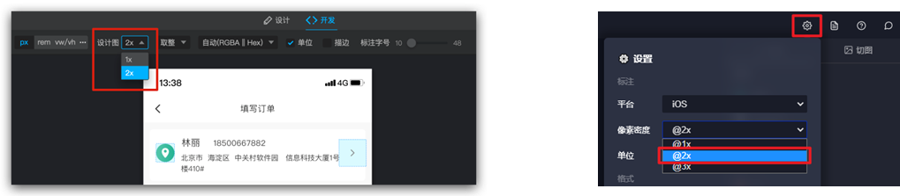
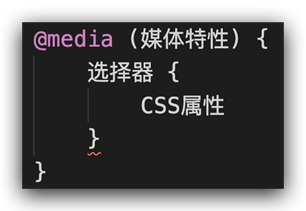
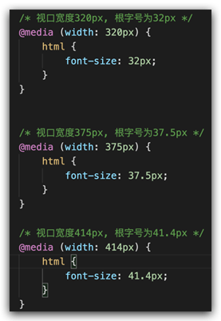

# rem基础

## 比如 less，rem，vh, vw 等 😀...

## 谷歌模拟器

模拟移动设备，方便查看页面效果


## 屏幕分辨率

分类：

- 物理分辨率：硬件分辨率（出厂设置）
- 逻辑分辨率：软件 / 驱动设置

结论：**制作网页参考 逻辑分辨率**


## 视口

作用：显示 HTML 网页的区域，用来约束 HTML 的尺寸

```html
<!DOCTYPE html>
<html lang="en">
  <head>
     
    <meta charset="UTF-8" />
     
    <meta http-equiv="X-UA-Compatible" content="IE=edge" />

    <!– 视口标签 -->
     
    <meta name="viewport" content="width=device-width, initial-scale=1.0" />

     
    <title>Document</title>
  </head>
  <body>
     
  </body>
</html>
```

- width=device-width：视口宽度 = 设备宽度
- initial-scale=1.0：缩放 1 倍（不缩放）

## 二倍图

概念：设计稿里面每个元素的尺寸的倍数

作用：防止图片在高分辨率屏幕下模糊失真

使用方法：



## 适配方案

- 宽度适配：宽度自适应

  - 百分比布局
  - Flex 布局

- 等比适配：宽高等比缩放
  - rem
  - vw

## 02-rem

## 简介

- rem 单位，是相对单位
- rem 单位是相对于 HTML 标签的字号计算结果
- 1rem = 1HTML 字号大小

## 媒体查询

媒体查询能够检测视口的宽度，然后编写差异化的 CSS 样式

当某个条件成立, 执行对应的 CSS 样式



```css
@media (width:320px) {
  html {
    background-color: green;
  }
}
```

## rem 布局

目前 rem 布局方案中，将网页等分成 10 份， HTML 标签的字号为视口宽度的 1/10。



## flexible.js

flexible.js 是手淘开发出的一个用来适配移动端的 js 库。

核心原理就是根据不同的视口宽度给网页中 html 根节点设置不同的 font-size。

```html
<body>
  <!--   源码   -->
  <script>
    (function flexible(window, document) {
      var docEl = document.documentElement;
      var dpr = window.devicePixelRatio || 1;

      // adjust body font size
      function setBodyFontSize() {
        if (document.body) {
          document.body.style.fontSize = 12 * dpr + "px";
        } else {
          document.addEventListener("DOMContentLoaded", setBodyFontSize);
        }
      }

      setBodyFontSize();

      // set 1rem = viewWidth / 10
      function setRemUnit() {
        var rem = docEl.clientWidth / 10;
        docEl.style.fontSize = rem + "px";
      }

      setRemUnit();

      // reset rem unit on page resize
      window.addEventListener("resize", setRemUnit);
      window.addEventListener("pageshow", function (e) {
        if (e.persisted) {
          setRemUnit();
        }
      });

      // detect 0.5px supports
      if (dpr >= 2) {
        var fakeBody = document.createElement("body");
        var testElement = document.createElement("div");
        testElement.style.border = ".5px solid transparent";
        fakeBody.appendChild(testElement);
        docEl.appendChild(fakeBody);
        if (testElement.offsetHeight === 1) {
          docEl.classList.add("hairlines");
        }
        docEl.removeChild(fakeBody);
      }
    })(window, document);
  </script>
  <script src="./js/flexible.js"></script>
</body>
```

## rem 移动适配

rem 单位尺寸

1.  确定基准根字号

- 查看设计稿宽度 → 确定参考设备宽度(视口宽度) → 确定基准根字号（1/10 视口宽度）

2.  rem 单位的尺寸

- **rem 单位的尺寸 = px 单位数值 / 基准根字号**

## 03-less

Less 是一个 CSS 预处理器, Less 文件后缀是.less。扩充了 CSS 语言, 使 CSS 具备一定的逻辑性、计算能力

注意：浏览器不识别 Less 代码，目前阶段，网页要引入对应的 CSS 文件

VS Code 插件：Easy LESS，保存 less 文件后自动生成对应的 CSS 文件


## 注释

- 单行注释
  - 语法：// 注释内容
  - 快捷键：ctrl + /
- 块注释
  - 语法：/_ 注释内容 _/
  - 快捷键： Shift + Alt + A

## 运算

- 加、减、乘直接书写计算表达式
- 除法需要添加 小括号 或 .
- 表达式存在多个单位以第一个单位为准


### 嵌套

作用：快速生成后代选择器


提示：用 & 表示当前选择器，不会生成后代选择器，通常配合伪类或伪元素使用


## 变量

概念：容器，存储数据

作用：存储数据，方便使用和修改

语法：

- 定义变量：@变量名: 数据;
- 使用变量：CSS 属性：@变量名;

```less
// 定义变量
@myColor: pink;
// 使用变量
.box {
  color: @myColor;
}
a {
  color: @myColor;
}
```

## 导入

作用：导入 less 公共样式文件

语法：导入: @import “文件路径”;

提示：如果是 less 文件可以省略后缀

```less
@import "./base.less";
@import "./common";
```

## 导出

写法：在 less 文件的第一行添加 // out: 存储 URL

提示：文件夹名称后面添加 /

```less
// out: ./index.css
// out: ./css/
```

### 禁止导出

写法：在 less 文件第一行添加:  // out: false


## 04-综合案例-极速问诊


## 准备工作

- 项目目录


- HTML 结构

```html
<link rel="stylesheet" href="./iconfont/iconfont.css" />
<link rel="stylesheet" href="./css/index.css" />

<body>
    ......  
  <script src="./js/flexible.js"></script>
</body>
```

- less 样式

```less
// out: ../css/

@import "./base";
```

## 头部布局

- HTML 结构

```html
<!-- 头部 -->
<header>1</header>
```

- less 样式

```less
// 头部
header {
  display: flex;
  justify-content: space-between;
  padding: 0 (15 / @rootSize);
  height: (44 / @rootSize);
  background-color: pink;
  line-height: (44 / @rootSize);
}
```

## 头部内容

- HTML 结构

```html
<a href="#" class="back"><span class="iconfont icon-left"></span></a>
<h3>极速问诊</h3>
<a href="#" class="note">问诊记录</a>
```

- less 样式

```less
.icon-left {
  font-size: (22 / @rootSize);
}

h3 {
  font-size: (17 / @rootSize);
}

.note {
  font-size: (15 / @rootSize);
  color: #2cb5a5;
}
```

## banner 区域

- HTML 结构

```html
<!-- banner -->
<div class="banner">
  
  <p><span>20s</span> 快速匹配专业医生</p>
</div>
```

- less 样式

```less
// banner
.banner {
  margin-top: (30 / @rootSize);
  margin-bottom: (34 / @rootSize);
  text-align: center;
  img {
    margin-bottom: (18 / @rootSize);
    width: (240 / @rootSize);
    height: (206 / @rootSize);
  }

  p {
    font-size: (16 / @rootSize);
    span {
      color: #16c2a3;
    }
  }
}
```

## 问诊类型布局

- HTML 结构

```html
<!-- 问诊类型 -->
<div class="type">
  <ul>
    <li>
      <a href="#">
        <div class="pic">1</div>
        <div class="txt">2</div>
        <span class="iconfont icon-right"></span>
      </a>
    </li>
    <li>2</li>
  </ul>
</div>
```

- less 样式

```less
// 问诊类型
.type {
  padding: 0 (15 / @rootSize);
  li {
    margin-bottom: (15 / @rootSize);
    padding: 0 (15 / @rootSize);
    height: (78 / @rootSize);
    border: 1px solid #ededed;
    border-radius: (4 / @rootSize);
    a {
      display: flex;
      align-items: center;
      // 内容在78里面垂直居中
      height: (78 / @rootSize);
    }
  }
}
```

## 问诊类型内容

- HTML 结构

```html
<div class="pic">
  
</div>
<div class="txt">
  <h4>三甲图文问诊</h4>
  <p>三甲主治及以上级别医生</p>
</div>
<span class="iconfont icon-right"></span>
```

- less 样式

```less
img {
  margin-right: (14 / @rootSize);
  width: (40 / @rootSize);
  height: (40 / @rootSize);
}
.txt {
  flex: 1;
  h4 {
    font-size: (16 / @rootSize);
    color: #3c3e42;
    line-height: (24 / @rootSize);
  }
  p {
    font-size: (13 / @rootSize);
    color: #848484;
  }
}
.iconfont {
  font-size: (16 / @rootSize);
}
```
