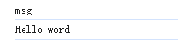
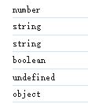
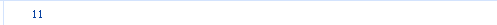
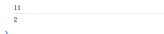

# 数据结构

## 基本数据类型

<script setup>import Table from './componets/Table.vue';
import ComparisonOperators from './componets/Comparison-operators.vue'
</script>

<Table></Table>

`注`：js是弱数据型的语言，只有当我们赋值了才知道是什么数据的类型

## String 字符串类型

用单引号或者双引号，反引号包裹来数据都是字符串

```js
let str1 = 'msg'
let str2 = 'Hello word'
console.log(str1)
console.log(str2)
```

运行结果：


### string模板 字符串

`String` 模板字符串 通常用来拼接字符串和变量，只能 `反引号`

`用模板字符串打印：我今天写了1000行代码`

```html
<body>
  <script>
      // 输入变量
      let num = 5
      
      // 输出语句
      // 模板字符串格式：外面用`` 里面用${变量名}
       document.write(`我今天写了${num}行代码`)  // [!code focus]
  </script>
</body>
```
运行结果:


## Boolean 布尔类型

boolean 布尔数据类型只有两个值，`真 true/假 false`。

```js
let flag = false
console.log(typeof flag)
```

## undefined 未定义类型

未定义类型 `undefined` 声明一个变量但未赋值，它只有一个值

```js
let num 
console.log(num)
```

## null 空类型

空类型 `null` 赋值了但内容为空，它只有一个值 `null`

```js
let obj = null
console.log(obj)
```

## 检测数据类型
语法为 ：`typeof x` 或 typeof(x)

```js
let num = 19
console.log(typeof num)   // Number
let str = 'pink'
console.log(typeof str)   // string
let str1 = '19'
console.log(typeof str1)   // sting
let flag = false
console.log(typeof flag)   // boolean
let un
console.log(typeof un)     // undefined
let obj = null
console.log(typeof obj)    // object

```



## 运算符 

## 赋值运算符

1. 赋值运算符
```js
// 采取赋值运算符
let num = 10
num += 1
console.log(num)
```



## 一元运算符
一元运算符有 `自增（++）自减（--）`, 经常用于计数用，比如用它来计算进行了几次操作。

 自增有`前置`自增和`后置`自增

```js
// 前置自增
let num = 10
++num
console.log(num)

// 后置
let num2 = 1
num2++
console.log(num2);
```


## 比较运算符
比较运算符有 `等于（==）`、`不等于（!=）`、`大于（>）`、`小于（<）`、`大于等于（>=）`、`小于等于（<=）` 
运行结果只有`（true或false）`

<ComparisonOperators></ComparisonOperators>

