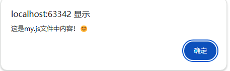
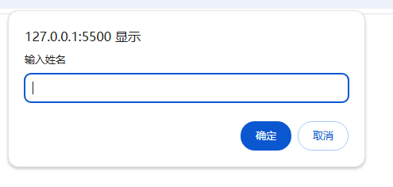
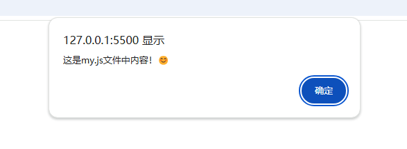

# 基础

## JS 概念

脚本（Script）实际上就是一段程序，通常以解释方式运行，无需编译，相对来讲，开发简便，运行效率高。

## JS 的书写位置

1. 内嵌式
   写于 `html` 文件里，`<script>`标签抱住，参考代码：

   ```html
   <!DOCTYPE html>
   <html lang="en">
     <head>
       <meta charset="UTF-8" />
       <meta name="viewport" content="width=device-width, initial-scale=1.0" />
       <title>Document</title>
     </head>
     <body>
       <script>
         alert("Hello Word！");
         // 页面弹出警示框的意思
       </script>
     </body>
   </html>
   ```

   运行结果：
   

2. 外部式
   将代码直接到标签内部，`列如`：

   ```html
   <body>
     <button onclick="alert('警示框')">点击按钮弹出提示框</button>
   </body>
   ```

   参考代码

   ```html
   <body>
     <button onclick="alert('Hello word')">点击按钮弹出hello Word</button>
   </body>
   ```

   运行结果：
   

3. 外部式 引入 (推荐)

通过新建一个以 `js` 为后缀名的文件，将代码写入，然后引入到 `html` 文件中。 我是推荐使用这个方式

```html

<body>
<script src="./my.js"></script>
</body>
```



## JS输入输出语法

1. 输入语法：

```html {3}

<script>
    // 输入语句
    prompt("请输入你的名字");
</script>

```

2. 输出语法：

```html

<script>
    //输出语句
    document.write("要输出的内容"); // [!code focus]

    // 页面弹出警告对话框
    alert("要输出的内容");  // [!code focus]

    // 控制台输出语法，程序员调试使用 
    console.log("控制台打印"); // [!code focus]
</script>

```




## JS 变量

## JS 变量概念

可以理解为变量一个可以用来存储数据的内容

## JS变量的语法

```js
// 如：声明一个年龄的变量

let age = 18;
```

## JS 变量的使用

```html

<script>
   // 创建变量
   let name = prompt("请输入你的名字");
   let age = prompt("请输入你的年龄");
   
   // 输出变量
   document.write("<h1>你好，" + name + "</h1>");
   document.write("<h1>你的年龄是：" + age + "</h1>");
   
   
</script>

```

`注`: 以前变量的写法是 `var`, 但现在一般都用 `let`, 现在 `var` 只在比较老的公司可能会用到，现在 `let` 是比较新的语法， `let` 是一个块级作用域的变量， `var` 是一个函数作用域的变量。 
`const` 是一个常量，不能修改， `const` 是一个块级作用域的常量。 


