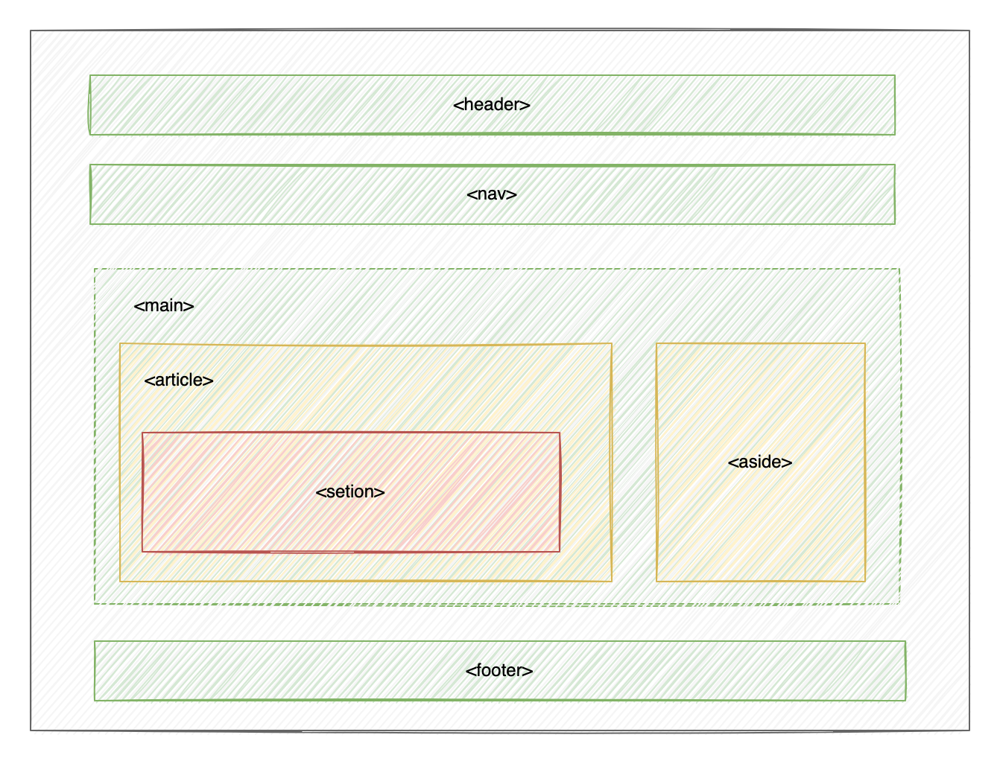

# 基础知识  

## 开发环境


* 前端学习基本上存在浏览器和开发工具即可
* 浏览器使用 `chrome`
* 开发工具使用 `vsocde` 免费使用开源跨平台
* 用到后台服务器使用 `waamp`,`xampp`, `mamp` 可以根据自己操作系统来选择

### chrome

`chrome` 是 `google` 推出的市场占有率最高的浏览器。因为`chrome`是开源的所以我们用的很多国内浏览器都是基于`chrome` 开发的

**查看源码**

我们查看其他网站源码有助于新手学习，同时有些 `HTML` 是后台脚本如 `PHP` 渲染出来来的，通过查看源码可以帮助我们分析问题


**控制台**

`console` 使用最多的调试功能，在 `html/css/js` 都会使用到


## 基础知识

HTML 不是一种编程语言，而是一种标记语言 `markup language`, 是网页制作所必备的，用于按不同标签声明网页中的内容

通过下图我们可以看到，一个网页友很多区域组合构成的，即使用 `HTML` 标签布局



### 文件命令

* 使用小写子线命令文件，不要出现中文字符
* 扩展名标准是 `.html`, 当然也可以使用 `.html`
* 多个单词可以使用 `-`或 `_` 链接，建议使用 `-` 字符如 `user_create.html`

### URL

统一资源定位符， 用于表示资源在网上的地址，每个部分以 `/` 进行分隔。

**http 资源访问**

```yaml
https://gingesmallfish.github.io/docs-demo/404.html
```

**FTP 文件下载**

```yaml
ftp:https://gingesmallfish.github.io/docs-demo/404.ptf
```

**MAILTO 邮箱地址**

```yaml
mailto:2300071698@qq.com
```

**参数说明**

| 参数                                | 说明                           |
|-----------------------------------|------------------------------|
| https                             | 访问协议 http 或 https，ftp，mailto |
| https://gingesmallfish.github.io/ | 服务器地址                        |
| /docs-demo/基础知识/html              | 资源目录                         |
| /01.基础知识.html                     | 文件名                          |

### 访问路径

#### 绝对路径

绝对路径包含 `主机+服务器地址+目录+文件`的完整的路径

```yaml
https://gingesmallfish.github.io/docs-demo/01.基础知识.html
```

#### 相对路径

相对路径是指相对路径对当前目录的地址

```yaml
# 当前目录的文件
2.html

  # 上目录中文件
../3.html

  # 子目录中的文件
block/user.html

  # 根目录中的文件
/bootstrap.html
```

## 注释

使用注释对一段 `html` 代码进行说明 方便自己或同事在未来清楚的明白代码意图。

```html
<!-- 这是导航条 START -->
<header role="navigation">
    <nav>
        <ul>
            <li>
                <a href="">博客搭建</a>
            </li>
            <li>
                <a href="">工具</a>
            </li>
        </ul>
    </nav>
</header>
<!-- 这是导航条 END -->
```
