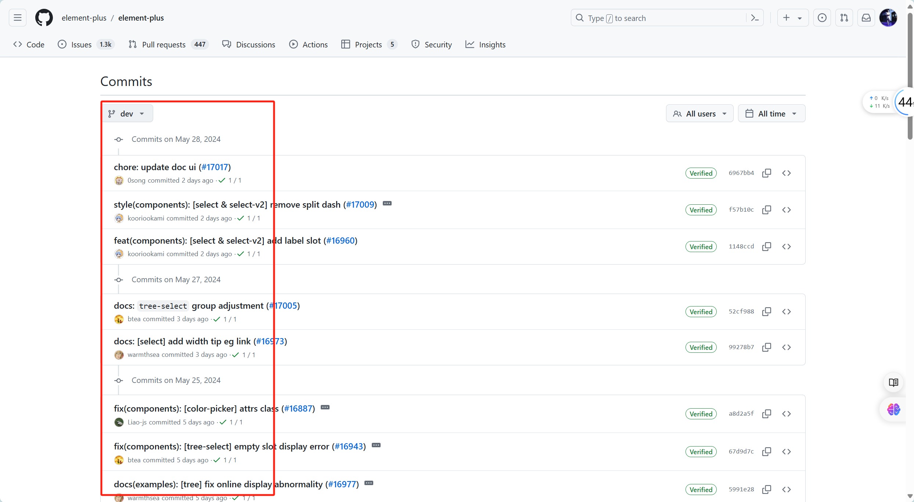

# git 代码提交规范， feat,fix, chore 都是什么意思

## 写到前面

经常看到别人提交的代码记录里面包含一些 `feat, fix, chore等等`,而我在提交时也不会区分什么，直接写下提交信息，
今天就是来看一下怎么个事情，就拿[element-plus](https://gitcode.com/gh_mirrors/el/element-plus/overview)

其实这么写是一种代码提交规范，当然不是为了当然不是为了炫技，主要目的是为了提高提交记录的可读性和自动化处理能力。

当然如果团队没有要求，不这么写也可以。



## git 提交规范

```bash
commite message = subject + : + 空格 + message 主体
```

**列如**: feat：增加用户注册功能

## feat 新功能 （feature）

    1, 用于提交新功能。
    2, 列如：feat：增加用户注册功能

## fix 修复bug

    1, 用于提交bug 修复
    2, 列如：fix： 修复bug登录页面崩溃的问题

## docs 文档变更

    1, 用于提交仅文档相关的修改
    2, 例如：docs: 更新README文件

## style  代码风格变动（不影响代码逻辑）

    1, 用于提交仅格式化、标点符号、空白等不影响代码运行的变更。
    2, 例如：style: 删除多余的空行

## refactor: 代码重构（既不是新增功能也不是修复bug的代码更改）

    1, 用于提交提升性能的代码修改
    2, 列如 refactor：重构用户验证逻辑

## perf 性能优化

    1, 用于提交提升性能的代码修改
    2, 例如：perf 优化图片加载速度

## test 添加或修改测试

    1, 用于提交测试相关的内容
    2, 例如test test: 增加用户模块的单元测试

## chore  杂项（构建过程或辅助工具的变动）

    1, 用于提交构建过程，辅助工具等相关的内容修改
    2, 例如：chore: 更新依赖库

## build 构建系统或外部依赖的变更

    1，用于提交影响构建系统的变更
    2, 例如：build: 升级webpack到版本5

## ci 持续继承配置的变更

    1， 用于提交ci配置文件和脚本的修改
    2， 例如：ci: 修改GitHub Actions配置文件

## revert 回滚

    1, 用于提交回滚之前的提交。
    2, 例如：revert: 回滚feat: 增加用户注册功能


## 总结 
使用规范的提交消息可以让项目更加模块化、易于维护和理解，同时也便于自动化工具（如发布工具或 Changelog 生成器）解析和处理提交记录。

通过编写符合规范的提交消息，可以让团队和协作者更好地理解项目的变更历史和版本控制，从而提高代码维护效率和质量
