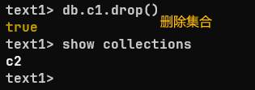

# MongoDB学习

[[toc]]


## 第一章:	MongoDB基础

1. 数据库简介
2. MongoDB简介
3. MongoDB安装
4. MongoDB基本操作
5. MongoDB文档增删改查 （CURD）
6. MongoDB实战教学管理系统数据设计

## 第二章:	MongoDB高级

1. MongoDB分页&排序
2. MongoDB聚合查询
3. MongoDB优化索引
4. MongoDB权限机制
5. MongonDB备份还原
6. 实战可视化管理工具

## 第三章:	学习API接口

1. mongodb简介（schema & model）
2. mongoose使用
3. 接口概念
4. 接口开发规范 （REstful API）
5. 接口测试工具 （Postman & Insomnia）
6. 实战教学管理系统学生模块开发
7. 实战接口文档开发apiDoc

# 学习目标

能够说出数据库的作用&中类

能够独立完成数据库设计

能够独立完成 **MongoDB** 数据库**CURD** 

能够实现分页，数据统计，索引， 备份等功能

能够使用**mongoose** 开发文档接口

能够使用**apiDoc**开发文档


# 数据库简介

## 为什么要学数据库

在实战中开发中

- 天猫：用户将商品加入购物车-下单-新增/修改收货人信息-创建订单
- 京东：用户将商品加入购物车-下单-新增/修改收货人信息-创建订单
- 等

网站都会产生大量的数据


 思考：这些数据存放在哪里呢

回答：**数据库中**

## 那数据库是什么？？？？

- 从技术角度看，数据库是一种用于存储、管理和检索数据的软件系统或数据结构。它可以将大量的数据按照特定的模型（如关系模型、层次模型、网状模型等）进行组织和存储，以便用户能够高效地进行数据的插入、删除、更新和查询操作。
- 从用户角度看，数据库就像是一个大型的信息库，用户可以把各种类型的数据（如文字、数字、图像、音频等）存入其中，然后根据自己的需求从中获取所需的信息。
- 分析：这里是一个案例
- **商品管理**：易购网商品众多，数据库用关系表存商品数据。像 “商品表”，有商品 ID、名称、价格、库存等字段。比如智能手表，ID 是 “001”，名称 “[品牌名] 智能手表” ，价格 1999 元，库存 500 件。利用数据库索引，用户搜 “智能手表”，系统能快速定位商品，展示列表。
- **用户管理**：“用户表” 存用户 ID、姓名、联系方式和收货地址等信息。新用户注册，数据录入表中；登录时，系统验证信息，保障账号安全，也方便按地址配送。
- **订单管理**：“订单表” 关联用户和商品，记录订单 ID、用户 ID、下单时间、订单状态和金额。用户下单生成订单 ID，状态设为 “待付款”。付款后，数据库自动更新库存，防止超卖。
- **数据分析**：数据库收集用户行为数据。若用户常买运动装备，系统据此推荐新品或优惠。这些分析结果也能帮采购部门调整采购计划，优化库存。
- 总结：数据就是用存放数据的厂库的

## 能干嘛

应用场景

用来存放项目数据，例如**淘宝，京东，天猫，滴滴等**


## 种类 （了解）

- 种类

  ​	关系型：Oracl，MySQL，SQLite，SQL Sserver等.....

  ​	非关系型（Not OnIy SQL）： MongoDB (文档) ，Redis/Memcache （内存）

- 关系型和非关系型数据库软件区别

  相同点:	都是数据库软件，用来存放在项目数据

  不同点：

  1. 关系型:	遵循SQL标准，换句话说语法大同小已，有库和表约束等
  2. 非关系型：没有统一标准，一般简直对形势式存储, 读取速度更快

- 关系型和非关系数据库软件如何选择

  


## 总结

为什么学:	项目存放数据需要，加薪

是什么:	计算机中用来存放数据的仓库

能干嘛:	存放淘宝，京东，天猫等项目数据

种类:	很多，根据不同业务场景选项，这篇文档学习MongoDB


# MongoDB简介

## 1，是什么 （了解）


- 基于分布式文件存储数据库（就是一个数据库）
- C++ 语言编写
- 支持的数据结构分长松散，是类似json的bson格式 （后期插入修改数据写的json）
- JSON （JavaScript Object Notation JS 对象简谱）是一种轻量的数据交换格式bson （二进制）

## 2，能干吗

- 存放项目的数据
- 实战工作开发写 **API**接口 （重要）
- 等.....

## 3，去哪里下载

windows版本下载：[Download MongoDB Community Server | MongoDB](https://www.mongodb.com/try/download/community)

版本说明

8.x （8.0.4也是最新版，更佳的数据管理，更浅的分布式架构，多文档事务），**以后可能会更新跟高得版本**

7.x

6.x,等多个版本

# MongoDB安装

## Win系统安装

1. 步骤1：下载，[Download MongoDB Community Server | MongoDB](https://www.mongodb.com/try/download/community)

2. 步骤2：解压

3. 步骤3：创建服务

   

   ```bash
   bin/mongod.exe --install -- dbpath 磁盘路径 --logpath 日志路径
   
   留心1: 比如通过管理员身份运行DOS窗口, 否则没有权限创建失败
   留心2：得提前创建数据和日志存放目录
   
   留心3：如果mongodb创建不成共 mongod --install --dbpath D:\mongodb\data --logpath D:\mongodb\logs\mongodb.log 那么你必须得配置环境变量，也就是系统变量 （重点）
   
   配置环境得教程 （重点）
   打开电脑设置->点击系统->系统信息->高级系统设置-环境变量-注意：（这里有两个系统变量，第一个是用户变量，第二个是，系统变量，我们直接选择）->系统变量->path这里是鼠标双击它->找到浏览-（找到自己安装得mongodb数据库位置）我这是安装得是D盘
   
   你也可以直接下载msi这个数据库里面是什么都配置好的，这里我是用zip
   ```

4. 步骤4：启动服务 

   ```bash
   net start mongodb
   ```

5. 步骤5：登录（验证码是否安装成功）

   ​		这里注意一下：以前的版本可以在控制台可以验证，但是现在不行了，一必须要单独下载 **MongoShll**

   ​		[MongoDB Shell Download | MongoDB](https://www.mongodb.com/try/download/shell),	以前是直接输入mongo是以前版本的，现在不行了

   ```bash
   bin/mongosh
   ```

6. 周边语法

   ```bash
   创建服务：mongod --install --dbpath D:\mongodb\data --logpath D:\mongodb\logs\mongodb.log （前提是一定要手动去创建data文件夹和logs文件夹也是mongodb文件夹下）
   删除服务：bin/mongod.exe-remove
   启动服务：net start mongodb (注意：serviec 服务名d restart/stop/start)
   关闭服务：net stop mongodb
   ```

   

# Mongodb基本操作

## @基本概念

- 生活中：仓库，架子，物品
- 计算机：数据库（database）, 集合 （collection）, 数据文档（document）

## @查看数据库

语法：show databases

效果


## @选择数据库

语法：use 数据库

效果


## @查看集合

语法：show collections

效果


## @创建集合

语法：db.createCollection("集合名")

效果


## @删除集合

语法：db.集合名.drop()

效果




思考：如何删除数据库

回答：第一步ues语法选择中数据库 2，通过db.dropDatabase()删除数据库


## 小总结

数据库（查看，创建，选择，删除）

```bash
查看：show databses

创建：有单独得语法，但是忽略	隐式创建

选择：use 数据库名

删除：第一步通过use选中数据库，第二步：通过db.dropDatabase()删除数据库
```

集合（查看，创建，删除）


```bash
查看：show collections

创建：db.createCollection('集合名')		多学一招：这个可以忽略，后期插入数据，隐式创建集合

删除：db.集合名.drop()
```

# MongoDB文档增删改查 （CURD）

## 明确需求

数据库中主要来存放项目数据

然后我们以及学会了数据库和集合得创建

思考：如何实现集合中得数据增删改查

回答：通过MongoDB语法即可

## #C增

语法：db.集合名.insert(JSON数据)

说明：集合存在-则直接插入数据，集合不存在-隐式创建

练习：在test数据库中c1集合中插入数据 （姓名加年龄18岁）


```bash
use test2

db.c1.insert({uname:"webopenfather",age: 18})

留心1：数据库和集合不存在都隐式创建

留心2：对象得键统一不加引号方便给看，但是查看集合数据时系统会自动加载双引号

留心3：mongodb会给每条数据增加一个全球唯一得_id建
```


多学一招：_id的组成


**思考1：是否可以自定义_id值**

```bash
回答：可以，只需要给插入到JSON数据增加_id键即可覆盖 （但实战强烈不推荐）

db.c1.insert({_id:1,uname:"webopenfather",age: 18})
```


**思考2：如果插入多条记录**

```bash
回答:	传递数据，数组中写一个个JSON数据即可
db.c1.insert([
	{uname: "张三", age: 11},
	{uname: "李四", age: 15},
	{uname: "王五", age: 32},
])

含义:	一次性插入三条数据到c1集合
```


**思考3：如何快速插入10条数据**

回答:	mongodb底层使用**JS**引擎实现的，所以支持部分js语法

因此：可以写for循环

```js
for(var i = 1; i<=10; i++){
    print(i)
}
需求：在test2数据库c2集合中插入10条数据，分别为a1 a2 ...a10

for(var i = 1; i<=10; i++){
    db.c2.insert({uname: "a"+i, age: i})
}
```


## #R查

基础语法: db.集合名.find(条件 [查询的列])

```
条件
	查询所有数据			{}或者不写
	查询age=6的数据		 {age:6}
	既要age=6又要性别=男	{age:6,sex:'男'}
	
查询的列 (可选参数)
	不写 - 这查询全部列 (字段)
	{age:1}		直显示age列 (字段)
	{age:0} 	除了age列 (字段都显示)
	注意：不管你怎么写系统自定义的_id都会在
```

升级语法

```mariadb
db.集合名.find({键:值})  注：值不能直接写
				{运算符:值}
db.集合名.find({
      键:{运算符:值}
})
```


| 运算符 | 作用     |
| :----: | -------- |
|  $gt   | 大于     |
|  $gte  | 大于等于 |
|  $lt   | 小于     |
|  $lte  | 小于等于 |
|  $ne   | 不等于   |
|  $in   | in       |
|  $nin  | not in   |


**练习1：查询所有数据**


**练习2：查询年龄大于5岁的数据**


**练习3：查询年龄是5岁，8岁，10岁的数据**


**练习4：只看年龄，或者年龄以外的列（_id别管它）**


## #U改

**基础语法：** db.集合名.update（条件，新数据[,是否新增，是否修改多条记录]）

```mariadb
是否新增: 指条件匹配不到数据则插入，true是插入, false否不插入默认
是否修改多条：将匹配成功的数据都修改 （true是，false否默认）


db.c3.update({uname:"zs1"},{uname:"zs2"})	这个错误的语法
```

**升级语法：** =》练习2

```mariadb
 db.集合名.update（条件，新数据[,是否新增，是否修改多条记录]）注意我这里用新的语法，
 
 db.c3.updateOne(
        {uname: "zs1"}, 
        {$set: {uname: "zs3"} },
 )
```


| 运算符  |   递增   |
| :-----: | :------: |
|  $inc   |   递增   |
|  $set   | 修改列值 |
| $unset  |  删除列  |
| $rename | 重命名列 |


**准备工作**

```js
use test2
for(var i = 1; i <= 10; i++){
    db.c3.insert({"uname":"zs"+i,"age":i})
}
```


**练习1：将{uname:"zs1"}改为{uname:"zs2"}**

```mariadb
发现:默认不是修改，而是替换
解决:使用升级语法，修改器
需求:使用星期将zs2的姓名改为zs22

db.c3.update({uname:"zs2"},{$set:{uname:"zs22"}})
```


**练习2：给{uname: "zs10"}的年龄加2岁或者减2岁**

```mariadb
db.c3.update({uname: "zs10"}, {$inc: {age: -2}})
```


**练习3：修改器综合练习**

**插入数据：db.c4.insert({uname: "姜小鱼",age:888,who:"男",other:"中国人"})**

```mariadb
完成需求：
uname: 	改成 张三       (修改器: $set)
age:	增加 111	  	 (修改器: $inc)
who:	改字段 sex	     (修改器: $rename)
other	删除			 (修改器: $unset)
```


语法分析

```mariadb
db.c4.update(
    {uname:"姜小鱼"},
    {$set: {uname: "张三"}},
    {$inc: {age: 111}},
    {$rename: {who: "sex"}},
    {$unset: {other: true}}
)

留心：如何一次性多个修改器
db.c4.update({uname:"姜小鱼"},{
             $set: {uname: "张三"},
             $inc: {age: 111},
             $rename: {who: "sex"},
             $unset: {other: true}       
             })
```


**练习4：验证码语法最后两个参数 (了解)**

【验证码】是否新增true还是false否：修改name等于zs30的年龄30岁

【验证码】是否修改多条是，false否默认

## #删

语法：db.集合.remove(条件,[,是否删除])

作用：是否删除一条 true是false否默认


## 小总结

高级开发工程师统称：所有数据库都需要增删改查CURD标识

MongoDB删除语法：**remove**

**增：Create**

```mariadb
db.集合名.insert(JSON数据)
```

**删：Delete**

```mariadb
db.集合名.remove(条件,[是否删除一条true是false否默认])
也就是默认删除多条
```

**改：Update**

```mariadb
db.集合名.update(条件,新数据 [,是否新增，是否修改多条])

升级语法：db.集合名.update(条件，{修改器：{键：值}})
```

**查：Read**

```mariadb
db.集合名.find(条件 [,查询的列])
```

# MongoDB实战教学管理系统数据库设计

## 数据库设计流程

根据UI设计稿

1. 确定功能模块所属集合
2. 确定集合字段

```mariadb
UI 设计稿每个展示内容对应一个字段
创建字段
更新字段
状态字段

最后：先中文，在英文
留心：上述规则照顾基础查的，如果是大神 或者 久而久之 就会变成肌肉记忆 下意思直接创建
```


## 练习

- 需求：根据教育管理系统，设置学生信息的集合，并且插入20条测试数据

- 代码

  ```js
  1.	先中文
  集合名称: 学生集合
  集合字段：编号，学号，姓名，电话，性别，年龄，学历，备注
  2.	在英文
  ues school
  for (var num = 1; num<=20; num++){
      db.stu.insert({
          id: num,
          no: "QF" + num,
          uname: "姜小鱼" + num,
          tel: "00000000",
          sex: "女",
          school: "研究生",
          remark: "富二代"
      })
  }
  
  ```

  

